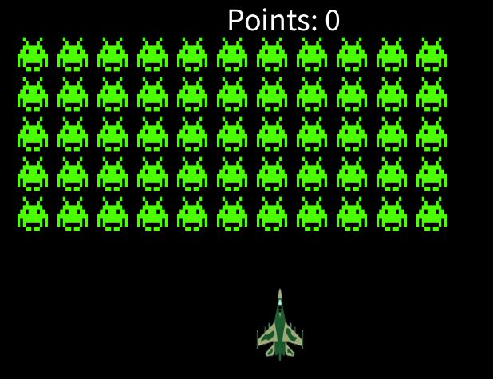

# 🛸 Space Invaders

A classic **Space Invaders**-style arcade game built using **Processing**.

<p align="center">
  
</p>

## 🚀 Features

- Player-controlled plane with bullet shooting
- Multiple rows of animated aliens
- Basic win/lose conditions
- Score tracking system
- Interactive main menu and "How To Play" screen
- Replayability with reset functionality


## 🎮 How to Play

- **Move Left:** `←` (Left Arrow)  
- **Move Right:** `→` (Right Arrow)  
- **Shoot Bullet:** `Space Bar`  

Aliens move horizontally and bounce downward. Destroy all aliens to win. If any alien reaches the bottom of the screen, you lose.


## 🛠️ Installation Instructions

### Requirements

- [**Processing**](https://processing.org/download/) (version 3 or 4 recommended)

### Steps to Run

1. **Download or Clone the Repository**
   ```bash
   git clone https://github.com/AryanKo/space-invaders.git

## Future Improvements

- Make the game size dynamic based on user screen size
- Add sound effects
- Add more levels
- Add upgrades to bullet and plane
